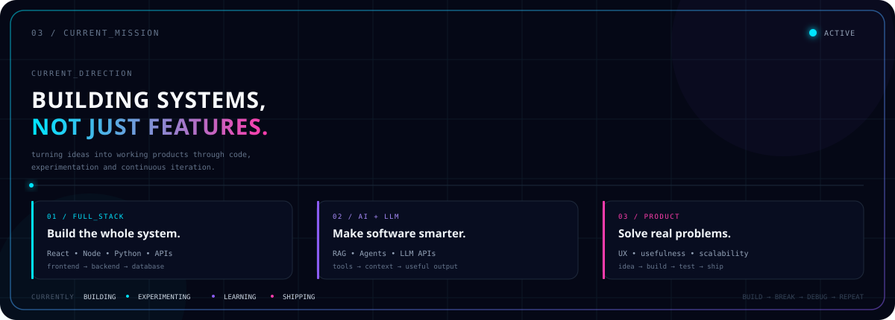
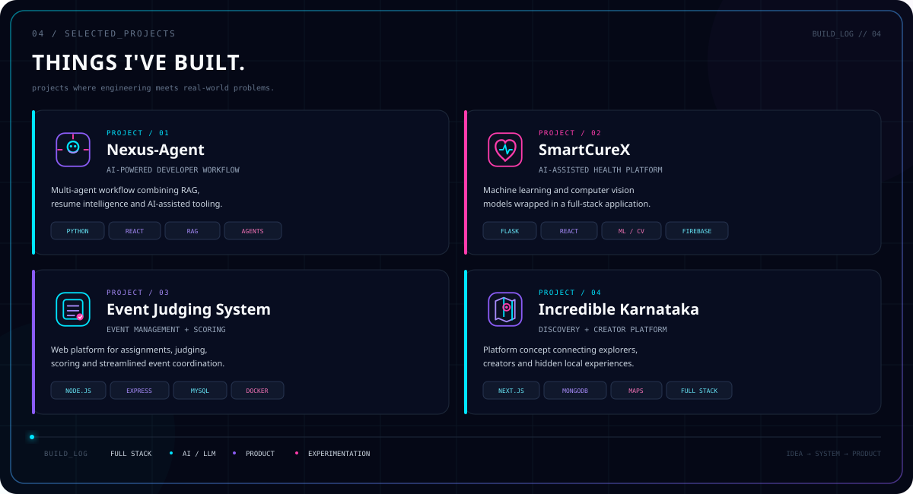
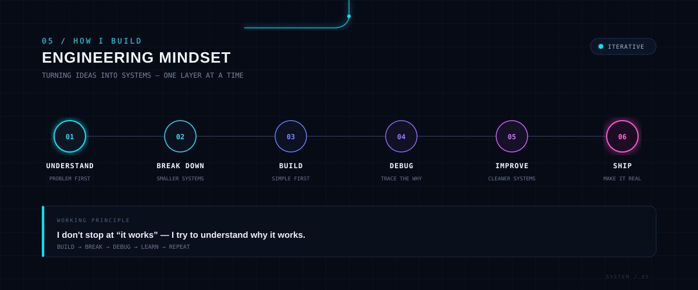
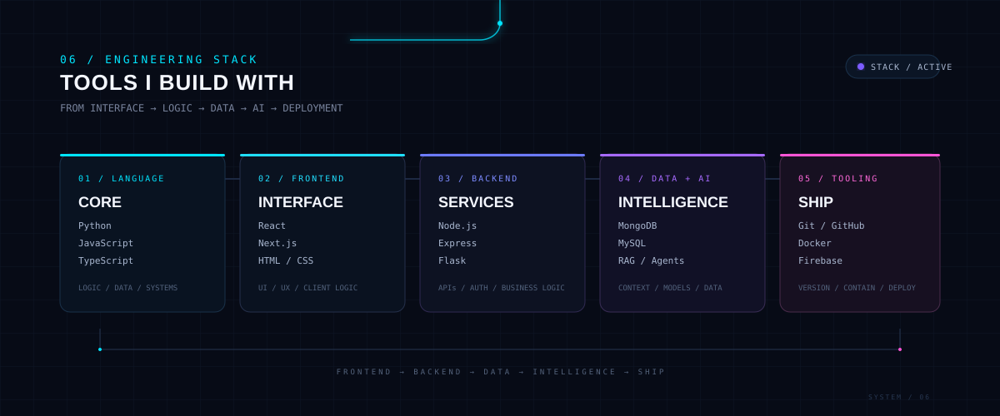
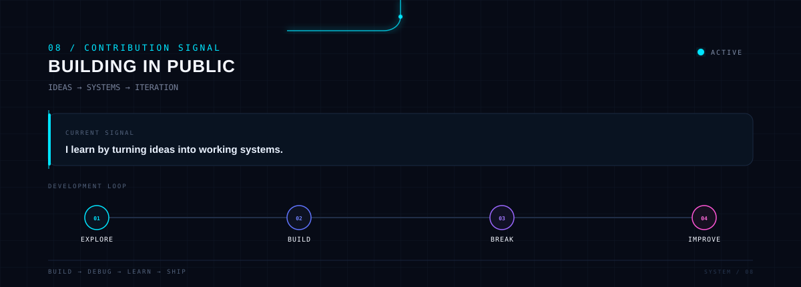
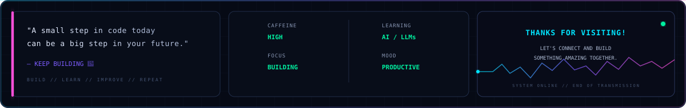

<!-- ========================================================= -->
<!-- SECTION 01 — DEVELOPER HERO                              -->
<!-- ========================================================= -->

  
  

 

<!-- ========================================================= -->
<!-- SECTION 02 — DEVELOPER IDENTITY                          -->
<!-- ========================================================= -->

  

  

## 04 / SELECTED PROJECTS

  

## 05 / HOW I BUILD

  

## 06 / ENGINEERING STACK

  

## 07 / GITHUB TELEMETRY

  
  

  

## 08 / CONTRIBUTION SIGNAL

  

## 09 / CONTACT ORBIT

  

<!-- GITHUB ACTIVITY -->

  

<!-- GITHUB STATS -->

  

  

<!-- CONTRIBUTION SNAKE -->

  

  

