

<!-- 1) Create a PUBLIC repo named exactly like your username  2) Find & replace Nishant9764, YOUR_PORTFOLIO_URL, YOUR_LINKEDIN, YOUR_EMAIL, YOUR_RESUME_URL -->



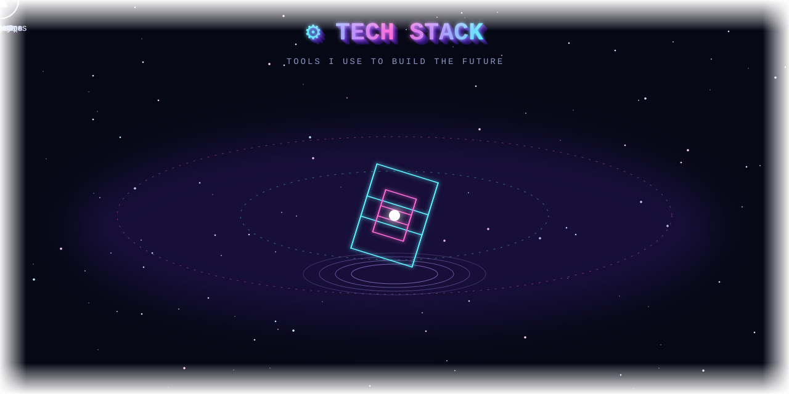

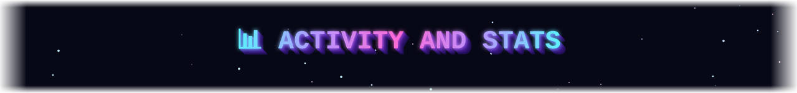

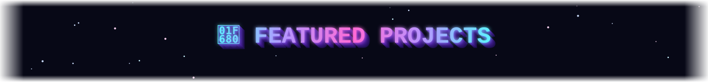

<table>
<tr>
<td><a href="https://github.com/Nishant9764/ai-recruiter">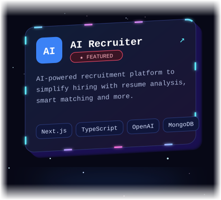</a></td>
<td><a href="https://github.com/Nishant9764/devnotes">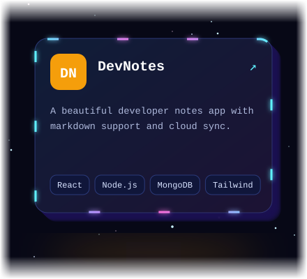</a></td>
<td><a href="https://github.com/Nishant9764/portfolio-v2">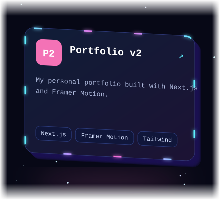</a></td>
</tr>
</table>

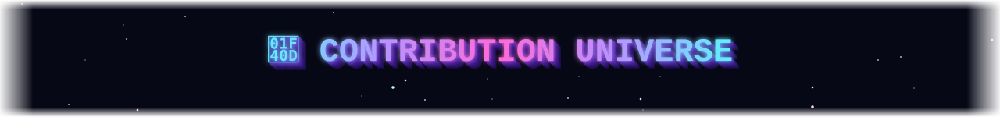

<picture>
  <source media="(prefers-color-scheme: dark)" srcset="https://raw.githubusercontent.com/Nishant9764/Nishant9764/output/github-snake-dark.svg">
  
</picture>

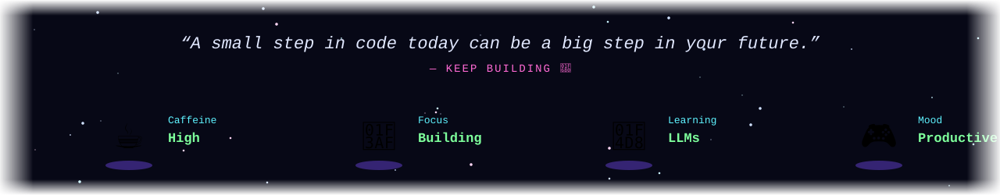


